# 🎼Siren Intro

`Siren`是一款简单(~~la ji~~)的Web漏洞扫描器（学习专用，作者的课设💦）

`Siren`为古希腊神话中人首鸟身的女海妖🐟💃，以美妙歌声🎵诱使航海者驶向礁石或进入危险水域☠

🤠在荷马史诗中，当奥德修斯将要经过塞壬所在海岛时，得到女神的忠告，预先采取了防备措施。他命令手下把自己牢牢地绑在桅杆上，让手下用蜡把各人的耳朵堵上🎣

📢在17世纪，人们为了防止船只触礁，就在暗礁附近用汽笛发出警报。由于这种警报声就像塞壬的歌声一样预示着危险，所以人们就把这种警报声叫做`Siren`

Web应用背后同样也可能隐藏着致命的漏洞，该漏洞扫描器旨在给Web应用做出漏洞报警，给出扫描报告供开发测试人员参考，以及时修补漏洞。

（如果你觉得本项目对你有帮助的话，能给个star就太好了）

可通过`VulHub`自搭靶场测试

> 注：项目中RCE均执行`id`命令
>
> 对于文件任意读取均读取`/etc/passwd`
>
> 对于不能回显的RCE使用DNS外带，`dnslog.cn`可能不稳定

# 🔧Usage

* 开发语言：Python3.9

* 运行依赖：Chrome浏览器、ChromeDriver

* 漏洞支持：25个漏洞

<details>
<summary>支持的漏洞列表 [点击展开] </summary>
[+] XSS
<br> [+] SQLI
<br> [+] FastJson
<br> [+] Struts2 S2-001
<br> [+] Struts2 S2-005
<br> [+] Struts2 S2-007
<br> [+] Struts2 S2-008
<br> [+] Struts2 S2-013
<br> [+] Struts2 S2-015
<br> [+] Struts2 S2-016
<br> [+] Struts2 S2-032
<br> [+] Struts2 S2-045
<br> [+] Struts2 S2-046
<br> [+] Struts2 S2-053
<br> [+] Struts2 S2-057
<br> [+] Struts2 S2-061
<br> [+] Apache Solr RCE CVE-2017-12629
<br> [+] Apache Solr XXE CVE-2017-12629
<br> [+] Apache Solr RCE CVE-2019-17558
<br> [+] Apache Solr RemoteStreaming Arbitrary File Reading and SSRF
<br> [+] Apache Flink Path Traversal CVE-2020-17519
<br> [+] ThinkPHP 2.x RCE
<br> [+] Thinkphp5 5.0.22/5.1.29 RCE
<br> [+] ThinkPHP5 5.0.23 RCE
<br> [+] Thinkphp6 Lang LFI
</details>

## 直接运行

若要直接在本机运行，请确保本机装有最新版Chrome浏览器

（第一次运行会在工程目录下，自动下载最新版Chrome Driver）

* --help 查看参数使用说明

`python scan.py --help`

> Usage: scan.py [OPTIONS]
>
> A tiny little scanner for vul detection
>
> Options:
>
> -u, --url TEXT                  url to scan
>
> -n, --num INTEGER               process number in scanning  [default: 1]
>
> -p, --program [all|php|java]    specify the backend program language when searching directories
>
> -c, --custom [Fastjson|Flink|Solr|Struts2|ThinkPHP] Customization Mode Else Traditional Mode
>
> --dir-brute                     discover potential web path
>
> --risk [0|1|2|3|4|5|6|7|8|9|10] The higher risk, the faster dirsearch work [default: 5]
>
> -l, --show                      list all the vuls supported
>
> --help                          Show this message and exit.

* -u, --url            指定扫描的url
* -n, --num          指定目录扫描和SQL盲注的进程数
* -p, --program    指定目录扫描对应的后端语言
* -c, --custom      指定扫描的特殊漏洞类型
* --dir-brute         开启目录扫描
* --risk                控制发包速率，risk越高发包越快
* -l, --show          打印支持的所有漏洞

## Docker环境

```sh
docker build . -t siren
docker run -it --name Siren siren /bin/bash
```

# 📺Demo

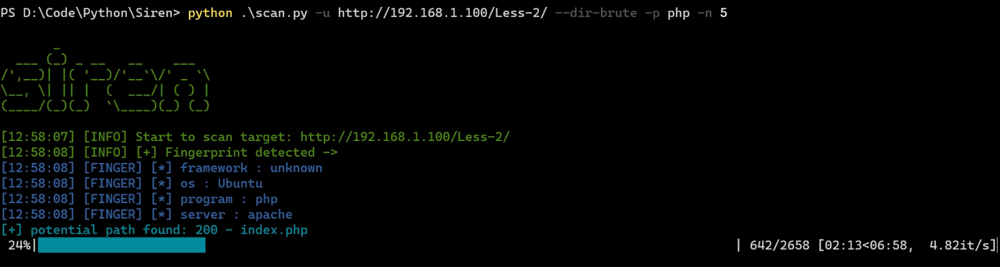

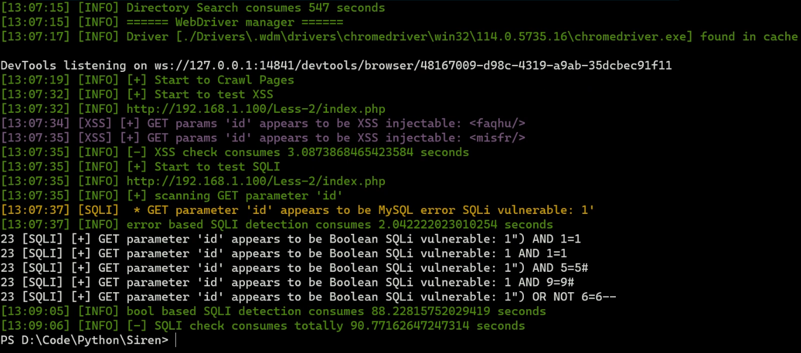

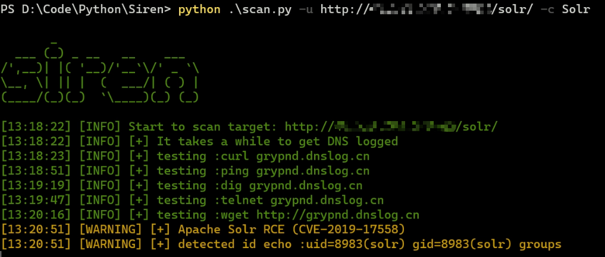


# 🎩免责声明

本工具仅面向合法授权的企业安全建设行为，在使用本工具进行检测时，您应确保该行为符合当地的法律法规，并且已经取得了足够的授权。

如您在使用本工具的过程中存在任何非法行为，您需自行承担相应后果，我们将不承担任何法律及连带责任。

# 🔎Module Detail

## 目录结构

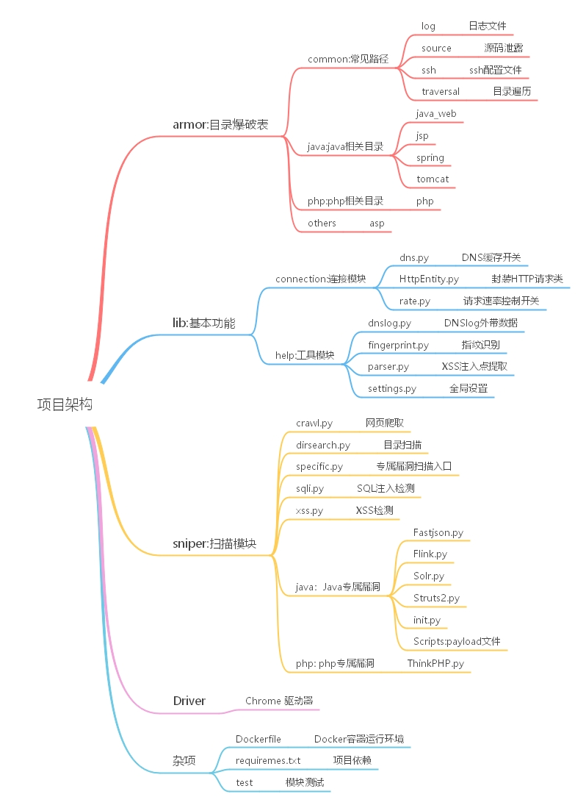

## 执行流程

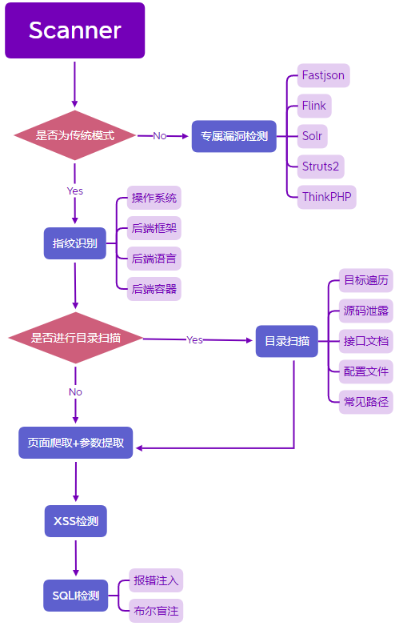

## DNS缓存

`lib/connection/dns.py`

重写了`socket.getaddrinfo`，维护一个`dns_cache`字典来存储host及其对应的IP信息

若缓存中查找不到host，则调用原`socket.getaddrinfo`发起DNS请求

```python
from socket import getaddrinfo

dns_cache = {}


def get_cached_addr(*args, **kwargs):
    """
    override socket.getaddrinfo to get dns cached
    """
    host, port = args[:2]  # 前两个参数为host和port
    if host not in dns_cache:
        dns_cache[host] = getaddrinfo(*args, **kwargs)
    return dns_cache[host]
```

其他模块想要开启DNS缓存，只需添加如下代码

```python
import socket
from lib.connection.dns import get_cached_addr
socket.getaddrinfo = get_cached_addr
```

## 速率控制

`lib/connection/rate.py`

同样也是重写`socket.socket.connect`，在连接前加上处理逻辑

```python
import time
from socket import socket
from lib.help.settings import RATE

# reserve the original connect function
_connect = socket.connect


def hooked_connect(*args, **kwargs):
    # print('connection hooked')
    time.sleep(RATE)
    _connect(*args, **kwargs)
```

其他模块想要开启速率控制，只需添加如下代码

```python
from socket import socket
from lib.connection.rate import hooked_connect

socket.connect = hooked_connect
```

后面的`crawl.py`由于使用了`Selenium`去控制浏览器，不会去调用`socket.connect`

为简便在`driver.get(link)`之后加了`time.sleep`

## 爬取解析模块

`sniper/crawl.py`

为适应动态渲染的网页，使用`Selenium`模拟浏览器爬取网页

### `Selenium`反爬

Js检测当前浏览器窗口下的 `window.navigator` 对象是否包含 `webdriver` 这个属性。

正常使用浏览器的情况下，这个属性是 `undefined`，而使用`Selenium`，这个属性被初始化为 `true`

可以想到使用`Selenium`提供的`execute_script`将`window.navigator` 对象置为`undefined`

```javascript
Object.defineProperty(navigator, "webdriver", {get: () => undefined})
```

但执行`execute_script`时页面已经加载完了。可以使用`execute_cdp_cmd`，会在网页的js执行前先执行

```python
driver.execute_cdp_cmd("Page.addScriptToEvaluateOnNewDocument", {
    "source": "Object.defineProperty(navigator, 'webdriver', {get: () => undefined})"
})
```

去除一些`Selenium`特征

```python
options = Options()
options.add_argument("--disable-blink-features")
options.add_argument("--disable-blink-features=AutomationControlled")
```

### 踩坑

由于后面开了多进程去跑SQLI注入检测，子进程会复制父进程的环境变量，所以`webdriver.Chrome(options=options)`不能放在全局作用域中（否则会疯狂弹浏览器）

### 爬取流程

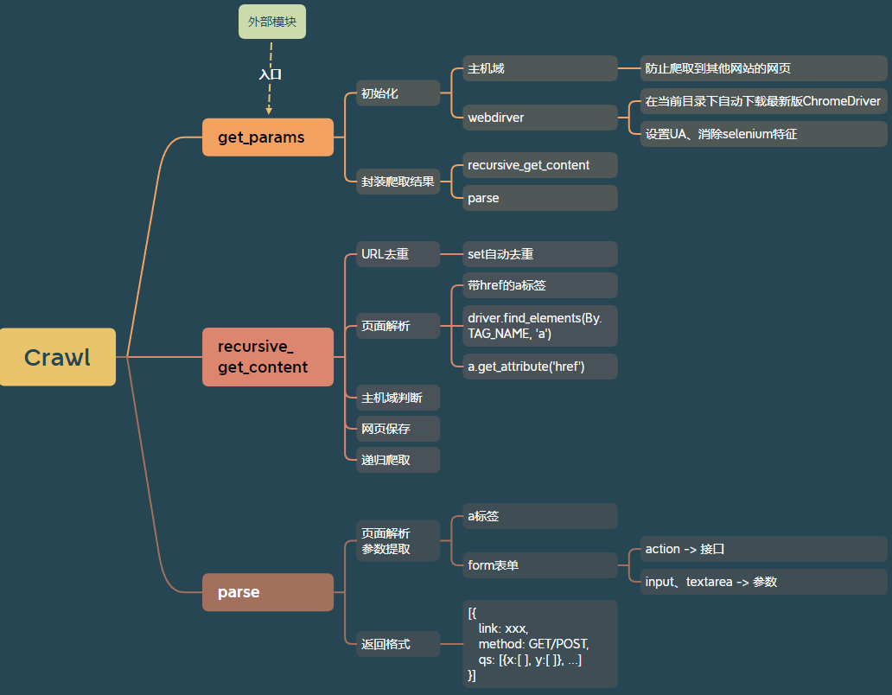

## 目录爆破模块

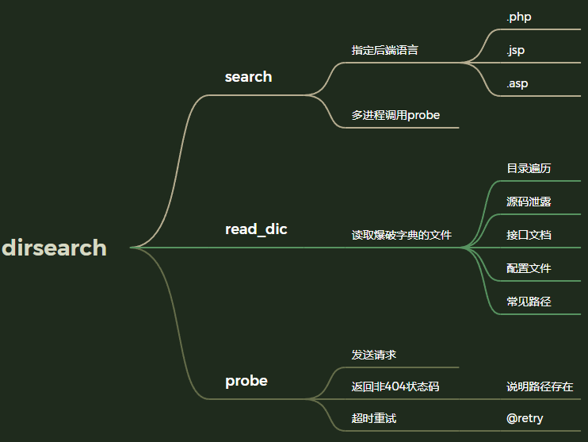

实际上有些网站就算路径不存在也会返回200状态码，因此仅通过状态码不足判断路径是否存在

还得识别页面有没有"访问的资源不存在"等字眼

## 指纹识别模块


该项目只做了简单的响应头的信息提取。

下面说说其他检测点：

* `favicon`：如SpringBoot、ThinkPHP等框架的默认网站logo固定。可以比对其logo的md5值

* 报错页面：发送不存在的路径，若没设置全局异常处理，SpringBoot返回`Whitelabel Error Page`

  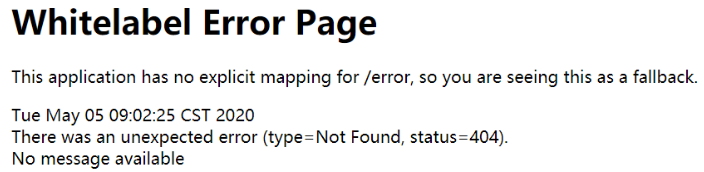

  ThinkPHP返回如下
  

* 页面标签属性。有些CMS的页面标签属性就指明了该CMS

## XSS模块

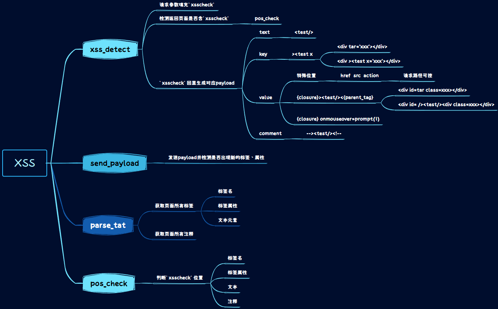

参考项目：

* [menkrep1337/XSSCon: XSSCon: Simple XSS Scanner tool (github.com)](https://github.com/menkrep1337/XSSCon)
* [w-digital-scanner/w13scan: Passive Security Scanner (被动式安全扫描器) (github.com)](https://github.com/w-digital-scanner/w13scan)

## SQLI模块

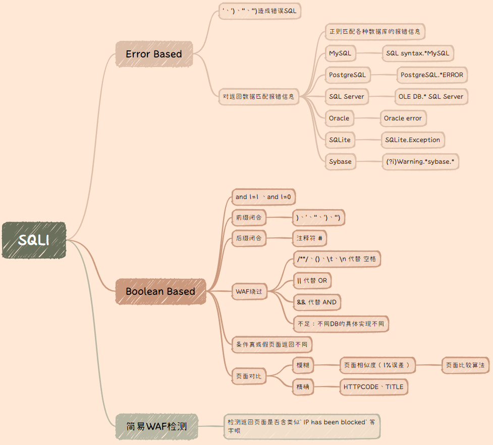

参考项目：

[stamparm/DSSS: Damn Small SQLi Scanner (github.com)](https://github.com/stamparm/DSSS)

（这个人是SQLMap的作者之一）

## DNSlog盲打

DNSlog就是DNS的日志，DNS在解析的时候会留下日志，可以在日志中读取自己域名的解析情况

DNSlog可用于外带数据，用于命令执行结果不回显的情况

一个域名的构成为：子域名 + 权威域名 + 顶级域名


下级域名的解析由上级管理，如下`test.wxcwf6.dnslog.cn`的解析需要经过`wxcwf6.dnslog.cn`，DNSlog平台会获取关于解析`wxcwf6.dnslog.cn`的所有记录

下面fun和test这两个子域名都解析到了同一个IP地址

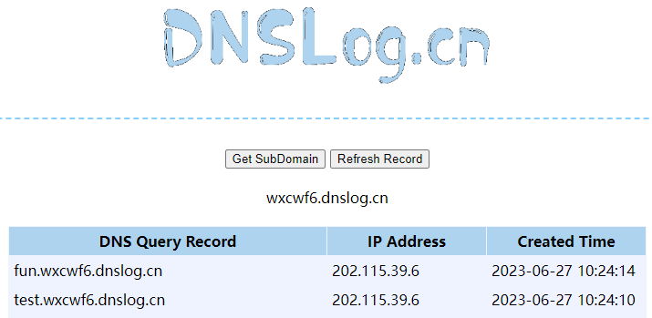

把命令执行的结果作为子域名去查询，在DNSlog平台就能找到这条记录，进而获取命令执行结果

但对于漏洞检测，我们只需证明其能发送DNS请求就能证明其执行了我们的命令

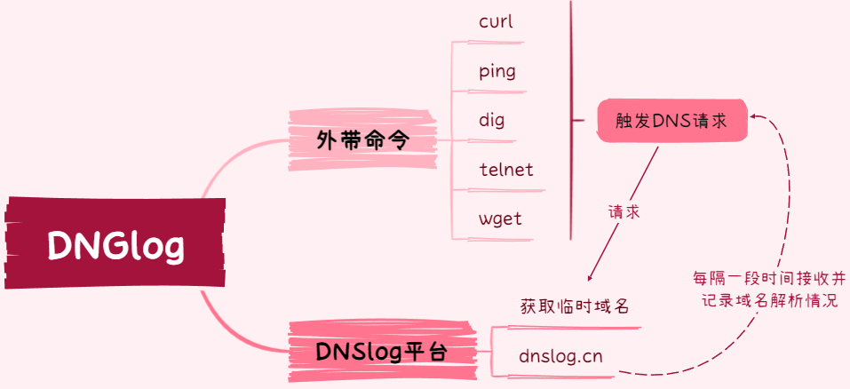

免费DNSlog平台：

* http://www.dnslog.cn/
* http://ceye.io
